# 🌍 Terra Vision 
Terra Vision is a microservices-based Geographic Information System (GIS) designed to enhance humanitarian demining efforts. By integrating Computer Vision (YOLO) with thermal imagery. 

<h3 align="center">
  ⚠️ WARNING: DATA ACCURACY ⚠️
</h3>

  
    The gis data in this system is for research purposes only. 
    It may contain inaccuracies and should not be used as a primary safety tool.
  

> **Project Status: Preview**
> This project is currently in a **preview state** and is still actively under development. Both the system architecture and the underlying AI detection models are subject to ongoing improvements and optimization to increase reliability and performance.

> **Model Weights**
> The trained YOLO weight files (`.pt`) are not included in this repository. If you want to test the project locally, model weight must be provided externally to the `terra-vision-ai` service to enable detection functionality.

<h3 align="center">🌍 PROJECT OVERVIEW</h3>

## 🌟 Key Features

* **Thermal AI Detection:** Uses **YOLOv11** architectures trained on the thermal imagery dataset, enabling the detection of explosive objects.
* **Scalable Microservices:** A distributed architecture built on **Spring Boot** and **FastAPI**, ensuring high availability and modularity.
* **GIS Integration:** Seamlessly interacts with **IMSMA**, visualizing hazard data through an interactive **Leaflet** interface.
* **Security:** Uses JWT based security implemented using **Spring Security** API together with **Spring Gateway ** for robust authentication and authorization.

## 🛠️ Technical Stack

### Backend & Infrastructure
- **Java (Spring Boot, Spring WebFlux, Spring Cloud Gatewat):** Core business logic and microservice management.
- **Python (FastAPI):** For computer vision tasks.
- **Security:** HashiCorp Vault, Spring Security, JWT, CSRF Token.
- **Caching:** Redis.
- **Containerization:** Docker & Docker Compose.

### Frontend
- **React & TypeScript:** Modern, type-safe user interface.
- **Leaflet:** Specialized map visualization and GeoJSON handling.

### AI & Research
- **Object Detection:** YOLOv11 + MGT dataset.

## 🏗️ Architecture Overview

Terra Vision is structured into several specialized services:
1.  **Auth-Service:** Centralized identity management.
2.  **Gateway-Service:** Unified entry point using Spring Cloud Gateway + Spring Security configurations.
3.  **AI-Service:** Python-based module for YOLO model inference and image processing.
4.  **GIS-Service:** Handles spatial data persistence and external API integration (IMSMA/ArcGIS).

## 🎓 Research Context

This project serves as the practical implementation of a research thesis: *Hliuza, Andrii; Gordienko, Yuri; Polukhin, Andrii; Leier, Mairo; Jervan, Gert; Stirenko, Sergii (2025). Adaptive Infrared Landmine Detection: From Compact Models to Deployment Strategies. figshare. Conference contribution. https://doi.org/10.6084/m9.figshare.30339064.v1"*

## 📂 Project Structure
1. **📂deployment:** Contains docker-compose, .env files and scripts
2. **📂docs:** Project documentation
3. **📂src:** Source code of microservices (ai, auth, gateway, gis, ui)

## 📂 Demo

  <strong>Home Page</strong> 
  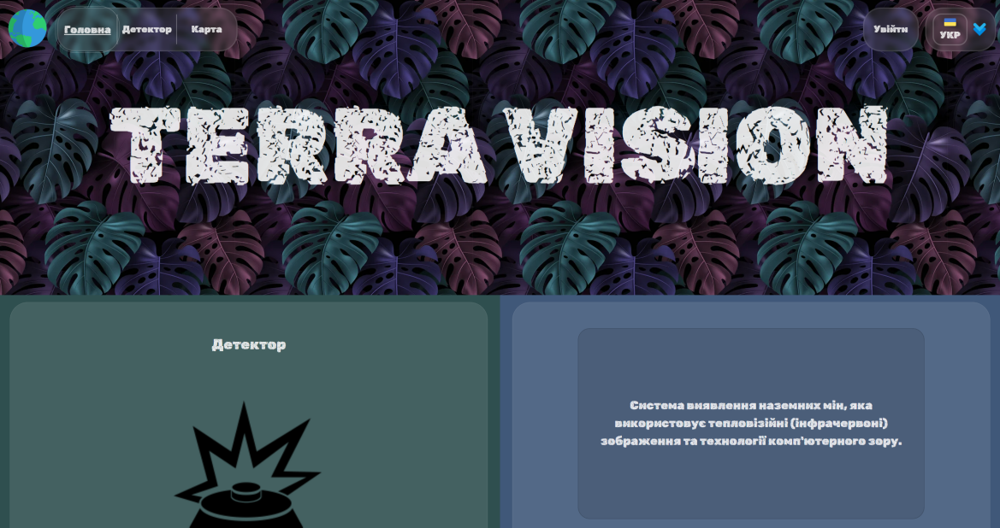

  <strong>Profile Page</strong> 
  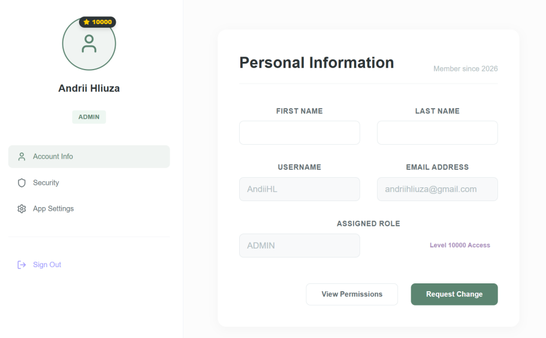

 

### 🔐 Access Control

  <strong>Login</strong> 
  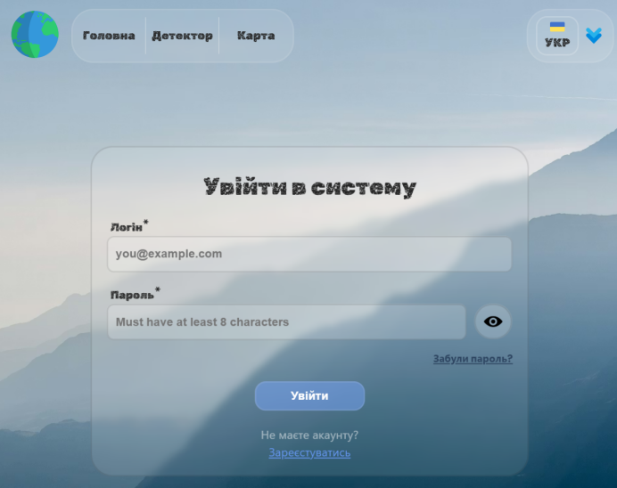

  <strong>Registration</strong> 
  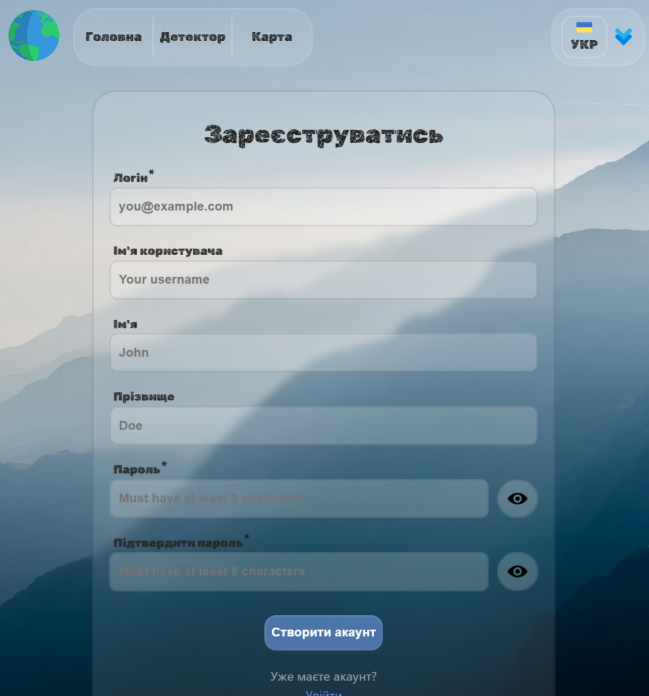

 

### 🗺️ GIS & Mapping

  <strong>Global Map View</strong> 
  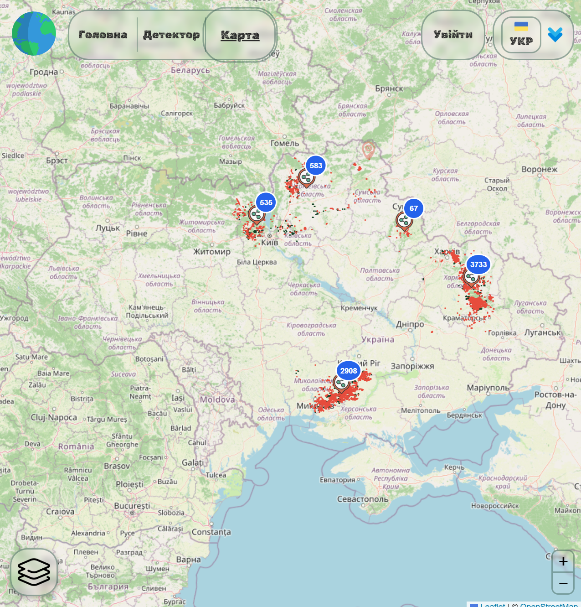

  <strong>Layer Management</strong> 
  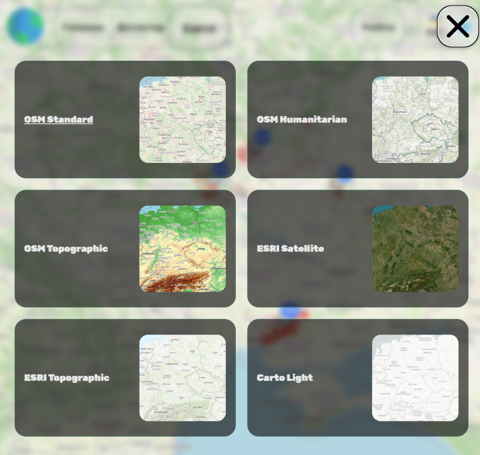

  <strong>Zone View</strong> 
  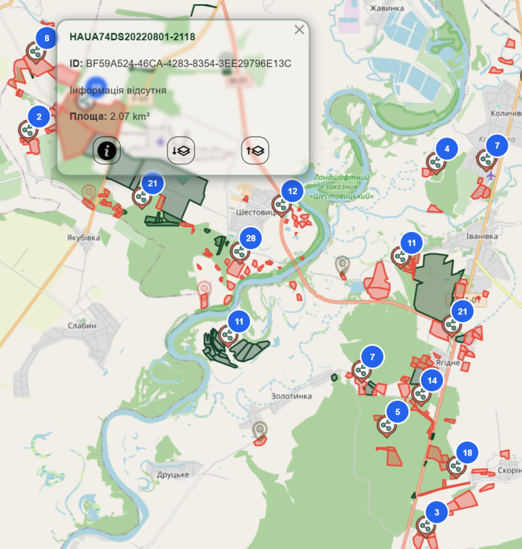

  <strong>Map Editor</strong> 
  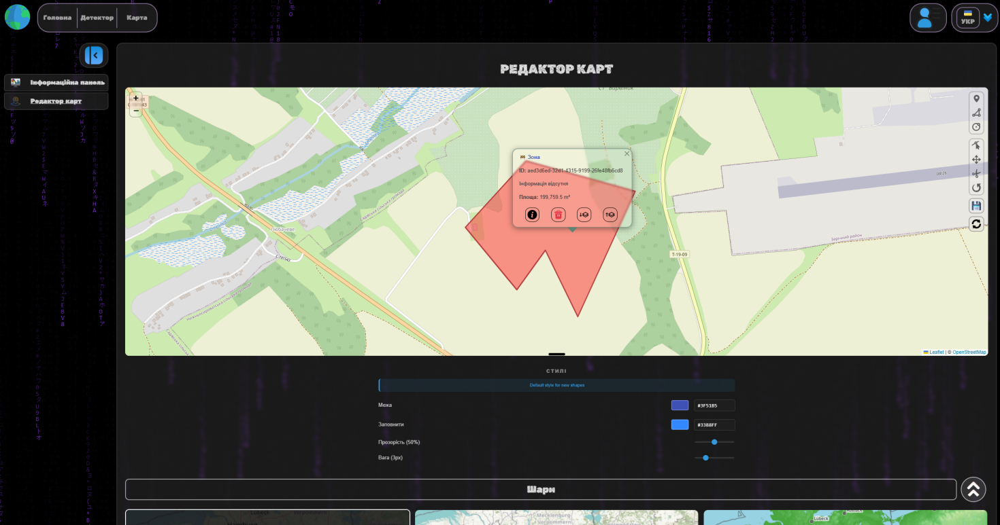

 

### 🔍 AI Detection (YOLO)

  <strong>Detection Interface - 1</strong> 
  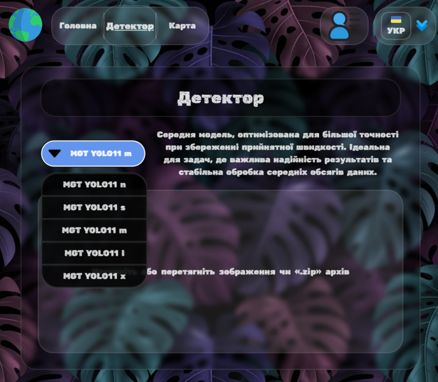

  <strong>Detection Interface - 2</strong> 
  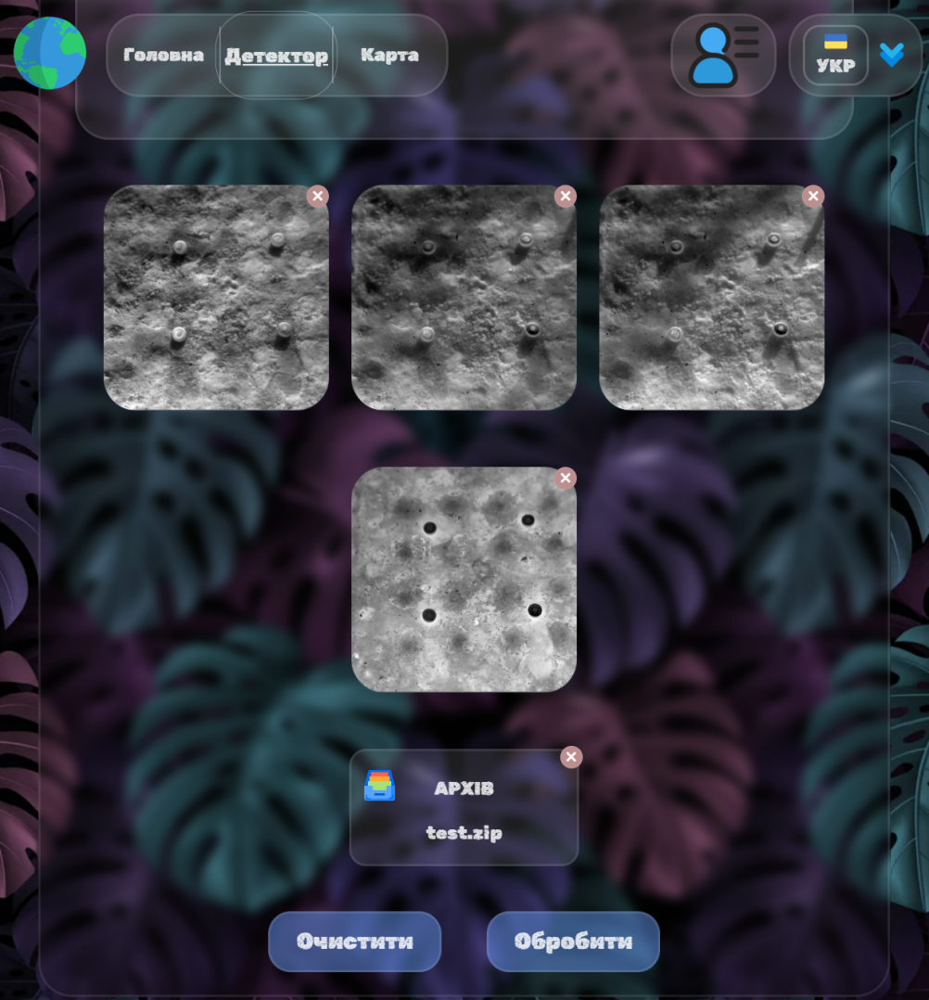

  <strong>Detection Interface - 3</strong> 
  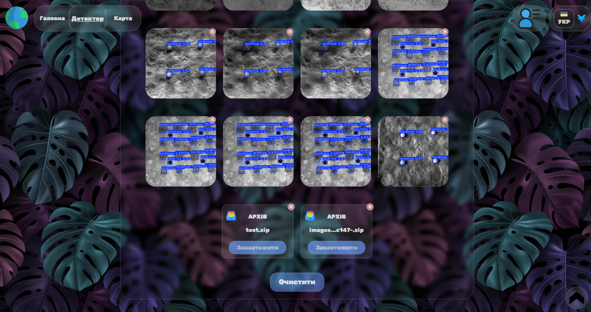

  <strong>Statistics & Analytics</strong> 
  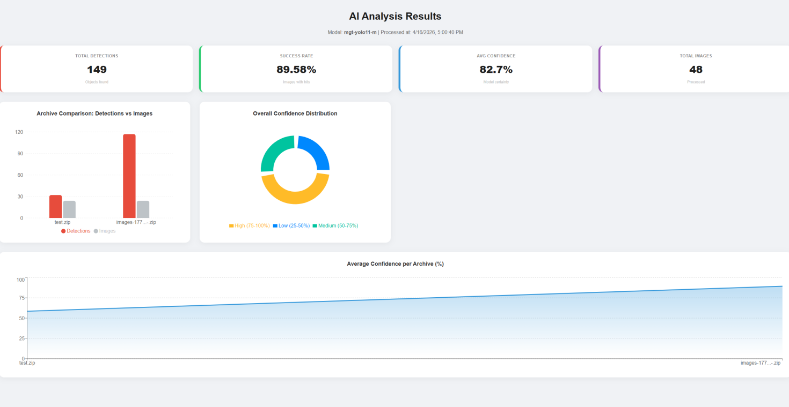

